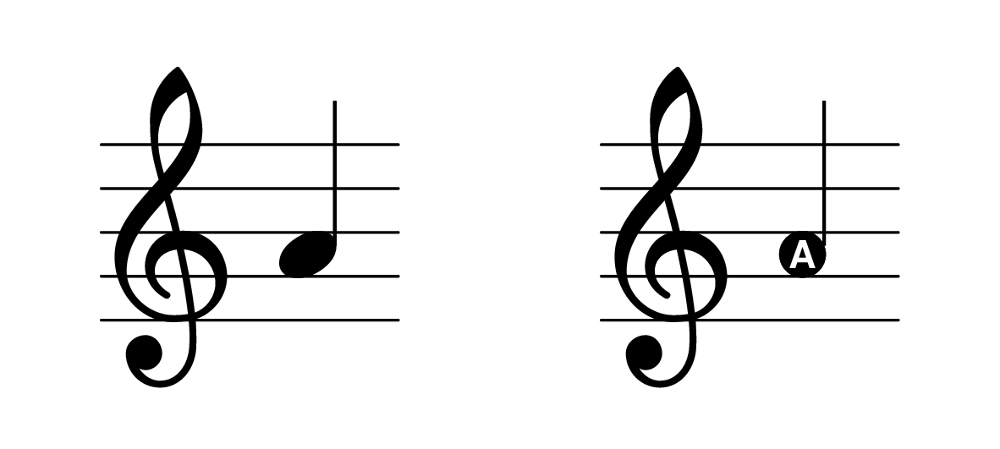
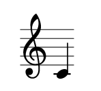
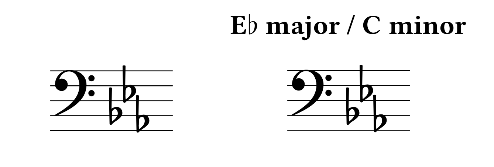
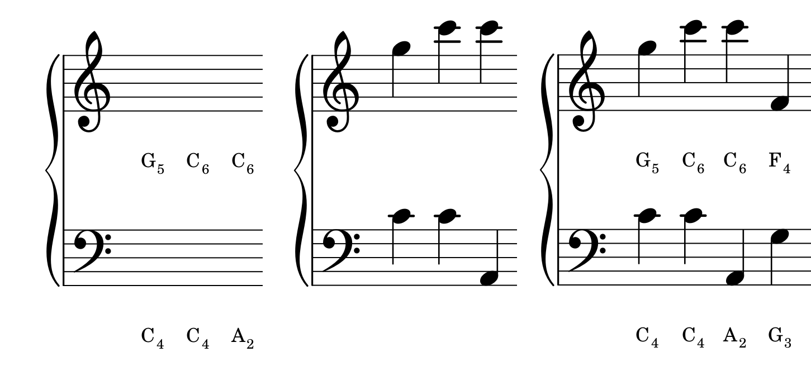

# Lilypond flash cards with LaTeX

 

Front- and back-side of one flashcard. 

## Precompiled files

[Treble Clef/G-Clef notes flashcards](pdfs/flashcards-treble.pdf)  
[Bass Clef/F-Clef notes flashcards](pdfs/flashcards-bass.pdf)

[Note practice sheets](pdfs/flashcards-treble.pdf)  
**Note:** You can generate new ones with random notes by running `python make-practice-sheet.py`.

[Treble Clef/G-Clef key signature flashcards](pdfs/key-signature-treble.pdf)  
[Bass Clef/F-Clef key signature flashcards](pdf/../pdfs/key-signature-bass.pdf)

## Make your own?
Read the section below and have a look into `make-note-sheet.py`, `make-time-signature-sheet.py`.
You will need to have Python, LaTeX, and Lilypond installed. 

## How does it work?
We start with a template [Lilypond](http://lilypond.org) (LaTeX for music engraving). It defines how we wish the staff to look.
The most simplest one would be like this: 
```
{
    <PLACEHOLDER>
}
```
If we replace `<PLACEHOLDER>` with `c'` which represents middle C, and simply compile it by running: <code>lilypond <a href=tmp/example.ly>example.ly</a></code> we get [this](tmp/example.pdf) output.

With some additional parameters, we can customize the output to not be a full-size page, remove the time signature, etc., and we get something like this:  


We then use a Python script to generate a new Lilypond file for each note that we want. Which it then compiles to a PDF file using Lilypond.

We the generate a LaTeX document in a similar fashion. The template is shown in [this file](templates/flashcards-template.tex). It is a document with the [`flacards`](https://www.ctan.org/tex-archive/macros/latex/contrib/flacards) document style. It automatically generates a front and a back back page, such that the correct items are matched when printing it out two-sided.

So for each PDF we generated, we insert a statement like this: 

```
\card{
    \includegraphics[width=.20\\linewidth]{a.pdf}
}{
    \includegraphics[width=.20\\linewidth]{a-ans.pdf}
}
```


## Example 
Here are some images taken from the pre-compiled sheets.


  

Front- and back-side of one key signature flashcard. 


   

Image from three paged practice sheets.


## For future reference
* Chords can be created using 'chordmode'. E.g. `\chordmode { c }`.
More info [here](http://lilypond.org/doc/v2.18/Documentation/notation/.chord-mode).


